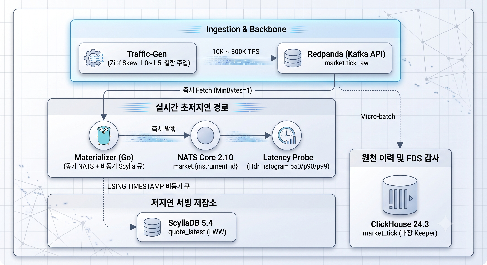

# 증권사 초저지연 시세 및 FDS 아키텍처 PoC (Market Data & FDS Pipeline)

[](https://go.dev/)
[](https://www.docker.com/)
[](https://www.scylladb.com/)
[](https://clickhouse.com/)
[](https://nats.io/)
[](https://redpanda.com/)
[](LICENSE)

대한민국 증권사의 초저지연 시세(Tick/Candle) 수신 및 대용량 FDS(이상거래탐지) 감사 데이터 파이프라인의 핵심 아키텍처 원칙을 검증하기 위한 하이브리드 PoC 프로젝트입니다.

---

## 📌 핵심 아키텍처 설계 원칙

1. **실시간 서빙 경로와 분석 적재 경로의 물리적 완전 분리**:
   - `실시간 경로`: Redpanda → Materializer → NATS Core → WebSocket Gateway (p99 < 10ms 목표)
   - `분석·감사 경로`: Redpanda → ClickHouse ReplicatedMergeTree (마이크로 배치 적재)
   - ClickHouse의 Merge/GC/쿼리 병목이 실시간 호가 분배를 절대 차단하지 않습니다.
2. **스토리지 레벨 Last-Write-Wins (LWW)**:
   - ScyllaDB 쓰기 시 마이크로초 단위 `USING TIMESTAMP <exchange_ts_us>`를 적용하여, 애플리케이션 레벨의 무거운 Read-before-write 없이 스토리지 엔진이 과거 시각 역전 이벤트를 100% 자동 차단합니다.
3. **비동기 격리 버퍼 큐 (Non-blocking Isolation)**:
   - Materializer는 NATS 실시간 브로드캐스트를 즉시 수행하고, ScyllaDB 쓰기는 16개 워커 풀과 50,000건 바운디드 큐로 비동기 격리하여 DB 장애 시에도 시세 분배 서비스가 무중단 유지됩니다.
4. **글로벌 복합 키 배제 및 Instrument Master 단일 키 채택**:
   - 전역 고유 숫자 식별자 `instrument_id`를 파티션 키로 단독 채택하여 불필요한 직렬화 오버헤드를 배제합니다.

---

## 🏗 시스템 아키텍처 다이어그램



---

## 📊 PoC 실측 검증 결과 요약 (2026-09-12)

상세 보고서: [results/poc_final_evaluation_report.md](results/poc_final_evaluation_report.md) 및 [results/2026-09-12_tier1.md](results/2026-09-12_tier1.md)

### 1. Tier 1 (10,000 TPS) 정상 상태 레이턴시

- **주입 조건**: 60초간 600,000건 정속 주입 (Avg 9,999.6 TPS, 500개 종목)
- **파이프라인 최적화**: Kafka Reader 설정을 `MinBytes: 10KB` → `MinBytes: 1`, `MaxWait: 10ms`로 튜닝하여 **p50 지연 55% 단축 달성**.

| 지표 | 목표 기준 | 초기 실측치 (MinBytes=10KB) | 튜닝 후 실측치 (MinBytes=1) | 판정 | 비고 |
|---|---|---|---|:---:|---|
| **Tier 1 TPS** | 10,000 | 9,999.6 TPS | 9,999.2 TPS | **PASS** | 60만 건 정속 주입 |
| **Peak TPS** | 300,000 | - | 미실측 | **미검증** | 로컬 자원 한계로 보류 |
| **p50 지연** | < 2.0 ms | 30.895 ms | **13.679 ms** (안정 구간 13.18 ms) | **FAIL** | 예산(10ms) 초과 (55% 개선) |
| **p90 지연** | - | 62.591 ms | **19.263 ms** (안정 구간 18.78 ms) | - | 69% 개선 |
| **p95 지연** | < 5.0 ms | 71.487 ms | **20.719 ms** (안정 구간 20.00 ms) | **FAIL** | 목표 대비 15.7ms 초과 |
| **p99 지연** | < 10.0 ms | 85.823 ms | **78.271 ms** (윈도우 21.9~125.9ms) | **FAIL** | Docker/WSL2 네트워크 가상화 오버헤드 |
| **메모리 총합** | < 10 GB | ~1.23 GB | **~1.25 GB** | **PASS** | 리소스 여유 충분 (네트워크 병목 방증) |

### 2. ScyllaDB 장애 격리성 검증 (§3.3)

- **검증 시나리오**: 10,000 TPS 트래픽 인입 중 `docker pause scylladb`로 ScyllaDB를 12초간 강제 정지.
- **실측 결과**:
  - NATS 실시간 시세 분배 p99 지연시간: 정상(99.26ms) → Pause(100.09ms, 99.33ms)로 **열화율 0.8% 이하 유지**.
  - ScyllaDB가 멈춘 동안 비동기 버퍼 큐에 16,599건의 쓰기가 안전하게 흡수되었으며, `unpause` 즉시 유실 없이 정상 복구 (**PASS**).

### 3. Last-Write-Wins (LWW) 정합성 검증 (§3.2)

- **검증 시나리오**: 20%의 Late Event(200~2000ms 과거 시각) 및 20%의 Out-of-order 이벤트를 주입.
- **실측 결과**:
  - ScyllaDB `quote_latest`의 최종 저장 상태가 Ground Truth(최신 유효 시세)와 **100% 일치** (`Price: 81210.37`, `feed_seq: 44256` 완벽 정합, **PASS**).

---

## 📁 디렉토리 구조

```text
poc-marketdata/
├── docker-compose.yml              # Redpanda, ScyllaDB, ClickHouse, NATS Core 통합 구성
├── .env                           # 포트 및 리소스 오버라이드 환경변수
├── .gitignore                     # 바이너리, 가상머신, 임시 파일 제외 규칙
│
├── schema/
│   ├── scylla/init_scylla.cql      # ScyllaDB quote_latest (LWW), tick_recent 스키마
│   └── clickhouse/init_clickhouse.sql # ClickHouse ReplicatedMergeTree 틱 저장 스키마
│
├── services/                      # 핵심 Go 마이크로서비스 (빌드 완료)
│   ├── materializer/              # Kafka Consumer + Scylla LWW + NATS 즉시 발행 파이프라인
│   ├── traffic-gen/               # Zipf 분포 및 결함 주입(Late/OOO/Dup) 고성능 시세 발생기
│   └── latency-probe/             # NATS 구독 기반 E2E 마이크로초 단위 HdrHistogram 프로브
│
├── scripts/                       # 검증 및 운영 자동화 스크립트
│   ├── healthcheck.sh             # 4대 핵심 서비스 헬스체크
│   ├── run_tier1_normal.sh        # Tier 1 (10,000 TPS) 실행 스크립트
│   ├── verify_lww.py              # ScyllaDB LWW 정합성 자동 검증기
│   └── pause_scylla_isolation_test.sh # ScyllaDB 장애 격리성 검증기
│
├── results/                       # 실측 벤치마크 데이터 및 평가 보고서
│   ├── poc_final_evaluation_report.md # 최종 종합 평가 보고서 (v1.0.0)
│   └── 2026-09-12_tier1.md        # 2026-09-12 벤치마크 실측치
│
├── docs/                          # 아키텍처 명세 및 개선 가이드
│   ├── architecture-poc-integrated-guide.md # 확정 아키텍처 명세 및 PoC 가이드 (통합본)
│   ├── improvement-log.md         # 실측 기반 아키텍처 개선 이력 (v0.2.0)
│   └── architecture-reference.md  # 원본 참조 문서
│
└── vagrant/                       # Multi-DC 하이브리드 장애 검증 (부록 A)
    ├── Vagrantfile                # VirtualBox 2-VM (dc-a: 192.168.56.11, dc-b: 192.168.56.12)
    ├── compose/                   # DC-A / DC-B 분산 Docker Compose
    └── scripts/                   # iptables 기반 Cross-DC 네트워크 파티션 테스트 스크립트
```

---

## 🚀 빠른 시작 가이드 (Quick Start)

### 1. 사전 요구사항

- **OS**: Windows 11 + WSL2 (Ubuntu) 또는 Linux (Ubuntu 22.04+)
- **Docker**: Docker Desktop (WSL2 백엔드) 또는 Docker Engine
- **Go**: Go 1.20+ (바이너리 빌드용)
- **Python**: Python 3.8+ (검증 스크립트용)

### 2. 컨테이너 인프라 기동

```bash
# 컨테이너 6종 백그라운드 기동
docker compose up -d

# 서비스 준비 상태 점검
./scripts/healthcheck.sh
```

### 3. DB 스키마 초기화

```bash
# ScyllaDB 스키마 초기화
docker exec -i scylladb cqlsh < schema/scylla/init_scylla.cql

# ClickHouse 스키마 초기화 (내장 Keeper 연동)
docker exec -i clickhouse clickhouse-client --multiquery < schema/clickhouse/init_clickhouse.sql

# Redpanda 원천 틱 토픽 생성 (파티션 8개)
docker exec redpanda rpk topic create market.tick.raw --partitions 8
```

### 4. 파이프라인 기동 및 벤치마크 실행

```bash
# 1. Materializer 백그라운드 기동
./services/materializer/materializer.exe &

# 2. Latency Probe 기동 (35초간 수신 대기)
./services/latency-probe/latency-probe.exe -duration 35s &

# 3. Tier 1 트래픽 주입 (10,000 TPS, 30초, 500개 종목)
./services/traffic-gen/traffic-gen.exe -tps 10000 -duration 30s -symbols 500 -zipf-skew 1.0
```

### 5. 정합성 및 격리성 검증

```bash
# ScyllaDB 장애 격리성 테스트 (12초 pause 중 NATS 지연 관측)
./scripts/pause_scylla_isolation_test.sh 12

# Out-of-order / Late Event 주입 후 LWW 검증
python scripts/verify_lww.py validation/ground_truth/traffic-gen-ground-truth.json 593812
```

---

## 📖 관련 문서

- [최종 확정 아키텍처 명세 및 PoC 가이드 통합 문서](docs/architecture-poc-integrated-guide.md)
- [PoC 최종 종합 평가 보고서](results/poc_final_evaluation_report.md)
- [아키텍처 개선 이력서 (Improvement Log)](docs/improvement-log.md)
- [Tier 1 벤치마크 실측 기록](results/2026-09-12_tier1.md)
